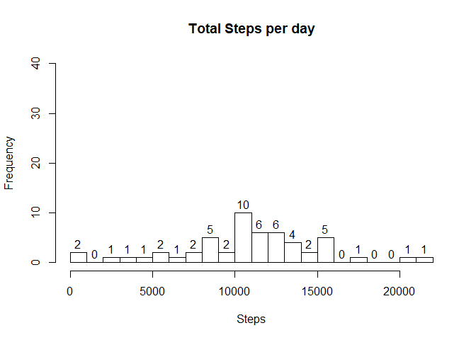

## Loading required libraries


```r
library(knitr)
library(ggplot2)
```

## 1. Code for reading in the dataset and/or processing the data


Load the CSV file into a R variable (data)


```r
data <- read.csv(unz("activity.zip", "activity.csv"))
```

Transform the date variable in data into a R date class (format YYY-MM-DD)


```r
data <- transform(data, date = as.Date(date))
```

## 2. Histogram of the total number of steps taken each day


Aggregate the sum of steps for each day and remove invalid numbers (NA)


```r
steps_per_day <- aggregate(steps ~ date, data, sum, na.rm = TRUE)
```

Create histogram plot of the numer of days for each range of numbers of steps


```r
hist(steps_per_day$steps, main = "Total Steps per day", xlab = "Steps", ylim = c(0,40), labels = TRUE, breaks = 30)
```

<!-- -->

## 3. Mean and median number of steps taken each day


Calculate the mean and median of total steps taken per day: 

- mean:


```r
mean(steps_per_day$steps)
```

```
## [1] 10766.19
```

- median:


```r
median(steps_per_day$steps)
```

```
## [1] 10765
```

## 4. Time series plot of the average number of steps taken


Aggregate the mean of steps for each day and remove invalid numbers (NA)


```r
mean_steps_interval <- aggregate(steps ~ interval, data, mean, na.rm = TRUE)
```

Create time series plot


```r
plot(mean_steps_interval$interval, mean_steps_interval$steps, type = "l", main = "Average number of steps per 5-min interval", xlab = "Interval", ylab = "Average Steps")
```

<!-- -->

## 5. The 5-minute interval that, on average, contains the maximum number of steps


Select the 5-minute interval with the maximum value for steps


```r
max_interval <- mean_steps_interval$interval[which(mean_steps_interval$steps == max(mean_steps_interval$steps))]
print(max_interval)
```

```
## [1] 835
```

## 6. Code to describe and show a strategy for imputing missing data


Report number of missing values in the dataset


```r
sum(is.na(data))
```

```
## [1] 2304
```

Replace NA with average value of the 5-min interval


```r
imputed_data <- data
for (i in 1:length(imputed_data$steps)) {
  if (is.na(imputed_data$steps[i])) {
    imputed_data$steps[i] <- mean_steps_interval$steps[mean_steps_interval$interval == imputed_data$interval[i]]
  }
}
```

Aggregate the data et report number of missing values in the dataset as a control


```r
imp_steps_per_day <- aggregate(steps ~ date, imputed_data, sum, na.rm = TRUE)
sum(is.na(imp_steps_per_day$steps))
```

```
## [1] 0
```

## 7. Histogram of the total number of steps taken each day after missing values are imputed


Repeat from step 4. with updated dataset produced in step 6. 


```r
hist(imp_steps_per_day$steps, main = "Total Steps per day", xlab = "Steps", ylim = c(0,40), labels = TRUE, breaks = 30)
```

<!-- -->

Calculate the mean of the imputed dataset, which is unchanged since we used the mean to fill the blanks


```r
mean(imp_steps_per_day$steps)
```

```
## [1] 10766.19
```

Calculate the median of the imputed dataset, which is different from the previously calculated median since we fill the blanks with an average value


```r
median(imp_steps_per_day$steps)
```

```
## [1] 10766.19
```

## 8. Panel plot comparing the average number of steps taken per 5-minute interval across weekdays and weekends


Add a variable wkdy to the dataset to determine whether this is a weekday or a weekend


```r
imputed_data$date <- as.Date(imputed_data$date)
imputed_data$wkdy <- "weekday"
imputed_data$wkdy[weekdays(imputed_data$date) == "Saturday" | weekdays(imputed_data$date) == "Sunday"] <- "weekend"
imputed_data$wkdy <- as.factor(imputed_data$wkdy)
imputed_data_interval <- aggregate(steps ~ interval + wkdy, imputed_data, mean, na.rm = TRUE)
```

Create the plot


```r
g <- ggplot(imputed_data_interval, aes(interval, steps))
g + facet_grid(wkdy ~ .) + geom_line() + ggtitle("Average number of steps per 5-min interval")
```

<!-- -->
